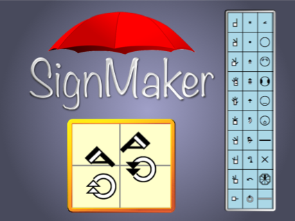

# @sutton-signwriting/signmaker

- - - 

@sutton-signwriting/signmaker is an online editor that can be <a href="https://sutton-signwriting.github.io/signmaker/" target="_parent">accessed directly</a>, <a href="https://sutton-signwriting.github.io/signmaker/demo.html" target="_parent">embedded in an iFrame</a>, and <a href="https://github.com/sutton-signwriting/signmaker/archive/refs/heads/main.zip" target="_parent">downloaded</a>.  It uses both Formal SignWriting in ASCII (FSW) and SignWriting in Unicode (SWU) character sets, along with the associated style string.  See <a href="https://tools.ietf.org/id/draft-slevinski-formal-signwriting-08.html" target="_parent">draft-slevinski-formal-signwriting</a> for detailed specification.

> Author: <a href="https://SteveSlevinski.me" target="_parent">https://SteveSlevinski.me</a>  
> Channel: <a href="https://www.youtube.com/channel/UCXu4AXlG0rXFtk_5SzumDow" target="_parent">https://www.youtube.com/channel/UCXu4AXlG0rXFtk_5SzumDow</a>  
> Support: <a href="https://www.patreon.com/signwriting" target="_parent">https://www.patreon.com/signwriting</a>  

---

## Useful links

- Public Editor: <a href="https://sutton-signwriting.github.io/signmaker/" target="_parent">https://sutton-signwriting.github.io/signmaker/</a>
- Public Demo: <a href="https://sutton-signwriting.github.io/signmaker/demo.html" target="_parent">https://sutton-signwriting.github.io/signmaker/demo.html</a>
- Source: <a href="https://github.com/sutton-signwriting/signmaker" target="_parent">https://github.com/sutton-signwriting/signmaker</a>
- Download: <a href="https://github.com/sutton-signwriting/signmaker/archive/refs/heads/main.zip" target="_parent">https://github.com/sutton-signwriting/signmaker/archive/refs/heads/main.zip</a>
- Issue Tracker: <a href="https://github.com/sutton-signwriting/signmaker/issues" target="_parent">https://github.com/sutton-signwriting/signmaker/issues</a>
- Online Discussion: <a href="https://gitter.im/sutton-signwriting/community" target="_parent">https://gitter.im/sutton-signwriting/community</a>
 
---

## URL Parameters
SignMaker supports eight keys for URL query parameters

* ui - language code for user interface
* alphabet - sign language code for symbol palette hierarchy
* fsw - the sign value in Formal SignWriting in ASCII (FSW)
* swu - the sign value in SignWriting in Unicode (SWU)
* styling - the style string for image creation
* grid - grid detail of 0,1,2
* skin - alternate displays such as "inverse" and "colorful"
* tab - the value for the tab to display

Example: https://sutton-signwriting.github.io/signmaker/#?ui=ase&fsw=AS10011S10019S2e704S2e748M525x535S2e748483x510S10011501x466S2e704510x500S10019476x475&skin=colorful  
Top Half of Demo: https://sutton-signwriting.github.io/signmaker/demo.html

---

## iFrame Messaging
1) embed SignMaker in an iFrame
2) send message to the iFrame using postMessage
3) receive message from the iFrame with an event listener for message

Bottom Half of Demo: https://sutton-signwriting.github.io/signmaker/demo.html#?fsw=AS10011S10019S2e704S2e748M525x535S2e748483x510S10011501x466S2e704510x500S10019476x475&skin=colorful

- - -

## License
MIT

- - - 

## SignWriting General Interest
- SignWriting Website: https://signwriting.org/
- Wikipedia page: https://en.wikipedia.org/wiki/SignWriting
- Email Discussion: https://www.signwriting.org/forums/swlist/
- Facebook Group: https://www.facebook.com/groups/SuttonSignWriting/
