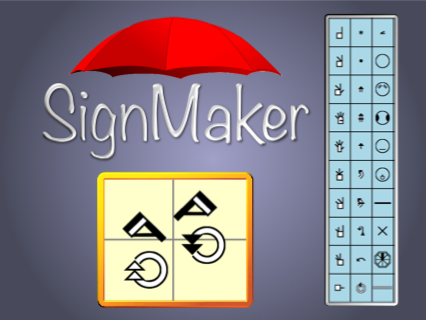

# @sutton-signwriting/signmaker

[](https://gitter.im/sutton-signwriting/community?utm_source=badge&utm_medium=badge&utm_campaign=pr-badge&utm_content=badge)
[](https://steveslevinski.me/#series/formal-signwriting)
[](https://doi.org/10.5281/zenodo.20074767)



@sutton-signwriting/signmaker is a web app for creating and editing signs using
Formal SignWriting in ASCII (FSW) and SignWriting in Unicode (SWU). It can be used
directly in the browser, embedded in an iframe, and controlled through URL hash
parameters or iframe messages.

## Use SignMaker

- Public Editor: <a href="https://www.sutton-signwriting.io/signmaker/" target="_parent">https://www.sutton-signwriting.io/signmaker/</a>
- Public Demo: <a href="https://www.sutton-signwriting.io/signmaker/demo.html" target="_parent">https://www.sutton-signwriting.io/signmaker/demo.html</a>
- Source: <a href="https://github.com/sutton-signwriting/signmaker" target="_parent">https://github.com/sutton-signwriting/signmaker</a>
- Issue Tracker: <a href="https://github.com/sutton-signwriting/signmaker/issues" target="_parent">https://github.com/sutton-signwriting/signmaker/issues</a>
- Online Discussion: <a href="https://gitter.im/sutton-signwriting/community" target="_parent">https://gitter.im/sutton-signwriting/community</a>

## About

SignMaker provides a visual signbox for arranging SignWriting symbols in two-dimensional
space. It supports symbol palette browsing, sequence editing, keyboard shortcuts,
multi-symbol selection, undo/redo, styling, and export to PNG or SVG.

Signs can be loaded, edited, shared, and saved as Formal SignWriting in ASCII (FSW) or
SignWriting in Unicode (SWU). Editing and export run in the browser. Optional language
tooling such as fingerspelling, mouthing, and translation uses remote SignWriting
services.

> Project steward: <a href="https://SteveSlevinski.me" target="_parent">Steve Slevinski</a>  
> Channel: <a href="https://www.youtube.com/channel/UCXu4AXlG0rXFtk_5SzumDow" target="_parent">https://www.youtube.com/channel/UCXu4AXlG0rXFtk_5SzumDow</a>  
> Support: <a href="https://www.patreon.com/signwriting" target="_parent">https://www.patreon.com/signwriting</a>  

## Specifications and Records

- Formal SignWriting: https://steveslevinski.me/#series/formal-signwriting
- Formal SignWriting DOI: https://doi.org/10.5281/zenodo.20074767
- Sutton SignWriting Platform: https://steveslevinski.me/#section/publications
- Platform DOI: https://doi.org/10.5281/zenodo.20041043

## URL Parameters

SignMaker supports eight keys for URL hash parameters.

| key | meaning |
| --- | --- |
| `ui` | language code for the user interface |
| `alphabet` | sign-language code for the palette symbol set |
| `fsw` | sign value in Formal SignWriting in ASCII |
| `swu` | sign value in SignWriting in Unicode |
| `styling` | style string for image creation |
| `grid` | grid detail: `0`, `1`, or `2` |
| `skin` | alternate display such as `inverse` or `colorful` |
| `tab` | active tab |

Example:
`https://www.sutton-signwriting.io/signmaker/#?ui=ase&fsw=AS10011S10019S2e704S2e748M525x535S2e748483x510S10011501x466S2e704510x500S10019476x475&skin=colorful`

## iFrame Messaging

Embed SignMaker in an iframe, send messages with `postMessage`, and receive save
messages from the iframe.

Load a sign by posting `{ fsw }`, `{ swu }`, or `{ signmaker: 'load', swu }`. The
same keys as URL parameters are accepted.

Save posts this message back to the parent window:

```js
{ signmaker: 'save', fsw, swu }
```

See <a href="https://www.sutton-signwriting.io/signmaker/demo.html" target="_parent">the public demo</a>
for a working harness.

## Develop

```sh
npm install
npm run dev
```

The app runs at `http://localhost:5173/`, with the iframe demo at
`http://localhost:5173/demo.html`.

## Build

```sh
npm run build:pages    # GitHub Pages build with /signmaker/ base path
npm run build:package  # static package/offline build with relative asset paths
```

`build:pages` is used by GitHub Actions for the public website. `build:package`
is reserved for a future static package or downloadable app archive.

## Test

```sh
npm test
npm run typecheck
```

## Stack

- [Vite](https://vite.dev) + [React 19](https://react.dev) + [TypeScript](https://www.typescriptlang.org)
- [Tailwind CSS v4](https://tailwindcss.com)
- [Zustand](https://github.com/pmndrs/zustand) for state
- [`@sutton-signwriting/core`](https://www.npmjs.com/package/@sutton-signwriting/core) and
  [`@sutton-signwriting/font-ttf`](https://www.npmjs.com/package/@sutton-signwriting/font-ttf)
  for FSW/SWU parsing, transforms, fonts, SVG, and PNG rendering
- [Playwright](https://playwright.dev) for end-to-end tests

## Repository Layout

```text
src/             # React app, stores, components, i18n, and SignWriting helpers
public/          # static assets, favicon, and palette alphabet data
tests/           # Playwright end-to-end suite
index.html       # editor entry
demo.html        # iframe demo harness
```

## Credits

SignMaker was created by [Steve Slevinski](https://SteveSlevinski.me) for Sutton
SignWriting.

The SignMaker 2 web app implementation was created by
[Amit Moryossef](https://github.com/AmitMY).

## License

MIT. Copyright (c) 2007-2026 Steve Slevinski and SignMaker contributors.

## SignWriting General Interest

- SignWriting Website: https://signwriting.org/
- Wikipedia page: https://en.wikipedia.org/wiki/SignWriting
- Email Discussion: https://www.signwriting.org/forums/swlist/
- Facebook Group: https://www.facebook.com/groups/SuttonSignWriting/
